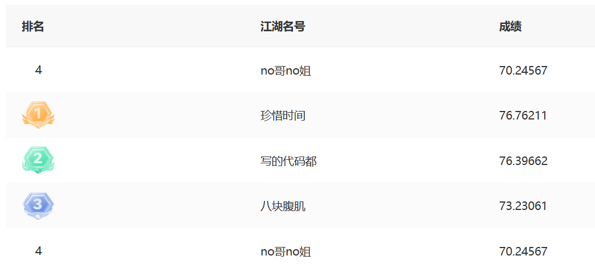

# Max-Code

### 初赛题目简介
广告机器学习服务平台每隔一段时间会产出一个较大的模型数据（几十或上百 GB），并且将其存储于 HDFS 中。要求设计一个分布式服务，能够加载模型数据，提供在线访问模型数据的能力，在新的模型数据产出时，服务自动加载使用新的模型数据，同时支持数据回滚能力，即服务加载指定版本的模型数据。

#### 简要思路
关键点：单个节点的内存无法存下整个模型数据。如果当请求到来时从磁盘加载数据，时延会很高。因此，将模型数据进行划分，各个节点加载其中的一部分到自己的内存中。请求到来时，节点从本地内存以及其他节点获取数据（同一集群下，网络速度快于磁盘速度）。也就是说，每个节点需要提供两个服务，一个接收用户的请求，另一个接收其他节点的请求（主要是 `RPC` 的使用与优化）。

更新与回滚：每个节点均使用一个线程周期性地向 HDFS 查询是否有新模型或者回滚需求产生。节点之间的同步借助 ETCD 来实现，简而言之，当本地加载数据完毕后（假设模型名为 `model_v1`，节点ID为 `x`），节点调用 `etcd.set("/model_v1/x")`，然后不断查询 `"/model_v1/"` 目录下的元素数量，直到达到节点总数量为止，意味着所有节点均已加载完毕，分布式服务可以使用新模型数据。

内存优化：事实上，任意时间点，节点内存中最多只用存储两个模型的数据。例如，初始时加载 `model_v1`，之后出现新模型 `model_v2`（注意在加载过程中服务不能断开，`model_v1` 的数据仍然会被使用），然后回滚到 `model_v3`（加载之前可以释放或者复用 `model_v1` 的内存）。

分数：

